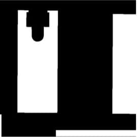
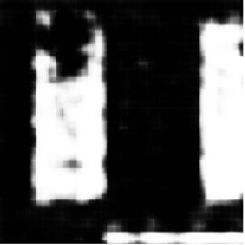
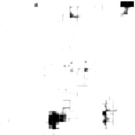
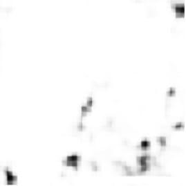

# Green Roof Segmentation in Milan

A geospatial computer-vision pipeline that combines municipal roof polygons with aligned aerial imagery to train pixel-wise segmentation models for identifying roofs considered suitable for green-roof conversion.

> **Academic context:** This work was completed in 2025 as a two-person university project. This standalone repository focuses only on the semantic-segmentation component; the separate optimization component from the [original team repository](https://github.com/eddrive/Green-Roofs-in-Milan) is intentionally excluded.

## Overview

The [Municipality of Milan](https://dati.comune.milano.it/dataset/ds1446_tetti-verdi-potenziali) publishes a GeoJSON dataset of roof areas assessed as potentially suitable for greening. The project explored whether those mapped areas could be recovered from aerial imagery through semantic segmentation.

The work covered the complete experimental data path:

1. Clean and normalize polygon and multipolygon geometries from the municipal GeoJSON.
2. Compare aerial basemaps and select the source with the best alignment to the vector labels.
3. Render the polygons over the aerial map and automate paired image capture with Playwright.
4. Convert the rendered overlays into binary raster masks with Python, OpenCV, and NumPy.
5. Train and compare two transfer-learning segmentation models.
6. Inspect individual and ensemble predictions at pixel level.

```text
Municipal GeoJSON polygons
          |
          v
2D geometry normalization
          |
          v
Vector overlay on aligned aerial imagery
          |
          v
Automated paired capture with Playwright
          |
          v
Binary-mask extraction and NPZ preprocessing
          |
          v
EfficientNetB7 / ResNet50 + ASPP experiments
          |
          v
Pixel-wise raster predictions
```

## Geospatial data preparation

The source contains polygon and multipolygon geometries. `geojson.py` recursively removes optional elevation values while preserving every feature and property. The cleaned vector data can then be rendered as a label layer above the aerial map.

Basemap choice mattered: the available imagery differed in resolution and coordinate alignment. Azure Maps provided the closest visual alignment for the experiment.

The browser collector visits deterministically sampled coordinates around Milan and captures matching 600 × 600 images with the overlay disabled and enabled. It records the center coordinate, CRS, zoom, viewport, and imagery provider in a JSONL manifest. The preprocessing stage extracts the overlay colour into a binary mask and stores filename-matched pairs in a compressed NPZ dataset.

## Segmentation experiments

Two TensorFlow/Keras approaches were explored:

- **EfficientNetB7** as a frozen ImageNet feature extractor with a transposed-convolution decoder.
- **DeepLabV3+-inspired model** with a ResNet50 backbone and atrous spatial pyramid pooling.

The experiment also averaged the probability maps from both models before thresholding an ensemble prediction. The mask-only images below are retained from the original course run as qualitative examples; aerial captures, the full generated dataset, and trained weights are not committed.

| Ground truth | EfficientNetB7 | ResNet50 + ASPP | Ensemble |
|---|---|---|---|
|  |  |  |  |
|  |  |  |  |

## Repository structure

```text
assets/                         README figures from the original experiment
scripts/capture_map.js          automated paired map capture
scripts/train.py                reproducible model-training entry point
src/green_roof_segmentation/
  geojson.py                    geometry cleanup and CLI
  models.py                     model definitions
  preprocess.py                 overlay-to-mask preprocessing and CLI
tests/                          focused preprocessing tests
web/                            local Azure Maps label viewer
```

## Running the pipeline

Python 3.11–3.13 and Node.js 18+ are recommended.

### 1. Install dependencies

```bash
uv sync --extra dev --extra training
npm ci
npx playwright install chromium
```

### 2. Prepare the municipal data

Download the GeoJSON source, then normalize it:

```bash
uv run greenroof-clean-geojson data/raw/potential_green_roofs.geojson \
  data/generated/cleaned_potential_green_roofs.geojson
```

### 3. Configure and serve the map

```bash
cp web/config.example.js web/config.js
# Add a restricted Azure Maps key to web/config.js.
npm run serve
```

Open `http://localhost:3000/web/`. The local `web/config.js` file is ignored by Git.

### 4. Capture paired imagery

In another terminal:

```bash
npm run capture -- --count 5000 --seed 42
```

Generated images and overlays are written below `data/generated/` and are intentionally ignored.

### 5. Build the compressed dataset

```bash
uv run greenroof-preprocess \
  data/generated/images \
  data/generated/overlays \
  data/preprocessed/dataset.npz
```

### 6. Train a model

```bash
uv run python scripts/train.py \
  --dataset data/preprocessed/dataset.npz \
  --model deeplab \
  --output models/deeplab.keras
```

The training script groups nearby captures into spatial cells before splitting them, reducing leakage between geographically overlapping train, validation, and test tiles.

## Limitations and next steps

- The labels represent roofs considered *potentially suitable* for greening, not observations of existing green roofs.
- The original experiment was limited to Milan; performance in other cities and against other imagery providers remains untested.
- Aerial tiles and vector records can be imperfectly aligned, making label quality dependent on the selected basemap.
- The current output is a raster segmentation mask. A natural next step is to convert predictions into GIS-ready polygons through morphological cleanup, contour extraction, simplification, georeferencing, and topology validation.
- Production use would require broader geographic validation, dataset versioning, provenance tracking, and repeatable evaluation against held-out regions.

## Attribution

Developed as a two-person university project by **Lorenzo De Luca** and **Edoardo Guida**. See [NOTICE.md](NOTICE.md) and the [original collaborative repository](https://github.com/eddrive/Green-Roofs-in-Milan) for provenance.

The potential-green-roof dataset is published by the Municipality of Milan under a [Creative Commons Attribution license](https://dati.comune.milano.it/dataset/ds1446_tetti-verdi-potenziali). Aerial imagery remains subject to its provider's terms and is therefore not redistributed in this repository.
